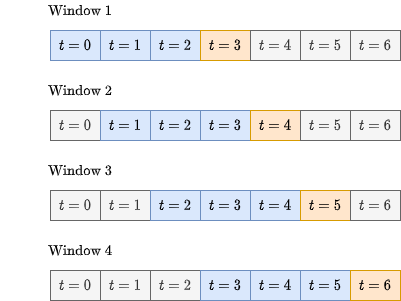

# Forecasting bike demand

This projects aims to create differente neural networks that predict the bike usage in a given set of intervals. The code uses datasets with each row as interval and each column with different data about that interval. This data can be: `hour`, `day_of_month` or `month` with the real data about the stations that are about to be predicted of the previous intervals. It also uses a sliding windows which a generator similar to the one that you can see in [this tutorial](https://www.tensorflow.org/tutorials/structured_data/time_series#data_windowing).

## Paper

The final paper can be viewed in [this repository](https://github.com/onmax/bachelor-thesis-paper/tree/main/data) where it shows more info, the results and some theory about neural networks and RNN.

## Models created

In this project 5 models have been developed:

- Baseline: It just return the prediction with the same data as one week before
- Dense: It is just two layers of dense units
- SimpleRNN: A SimpleRNN layer with a dense one
- LSTM: A LSTM layer with a dense one
- Autoregressive: A model that uses its own prediction as input. Also it relays heavily on [this tutorial](https://www.tensorflow.org/tutorials/structured_data/time_series#advanced_autoregressive_model).

## WindowGenerator

It follows the same logic as in the [tutorial of Tensorflow](https://www.tensorflow.org/tutorials/structured_data/time_series#data_windowing).

It can create subdatasets given a dataset. Given a dataset of 7 intervals, and the window configuration as 3 inputs and 1 output will generate 4 windows. Graphically:

## Original dataset

The original dataset is from the company [Divvy in Chicago](https://divvy-tripdata.s3.amazonaws.com/index.html). Some modifications have been developed and part of the data is being saved in this repository as [byte files](./data/parts).

## Library used

This project depends mainly on:

- Tensorflow and Keras as Machine Learning library
- Pandas and Numpy as data structures libraries
- Matplotlib for plotting with SciencePlot theme

#### This project has been my bachelor's thesis.